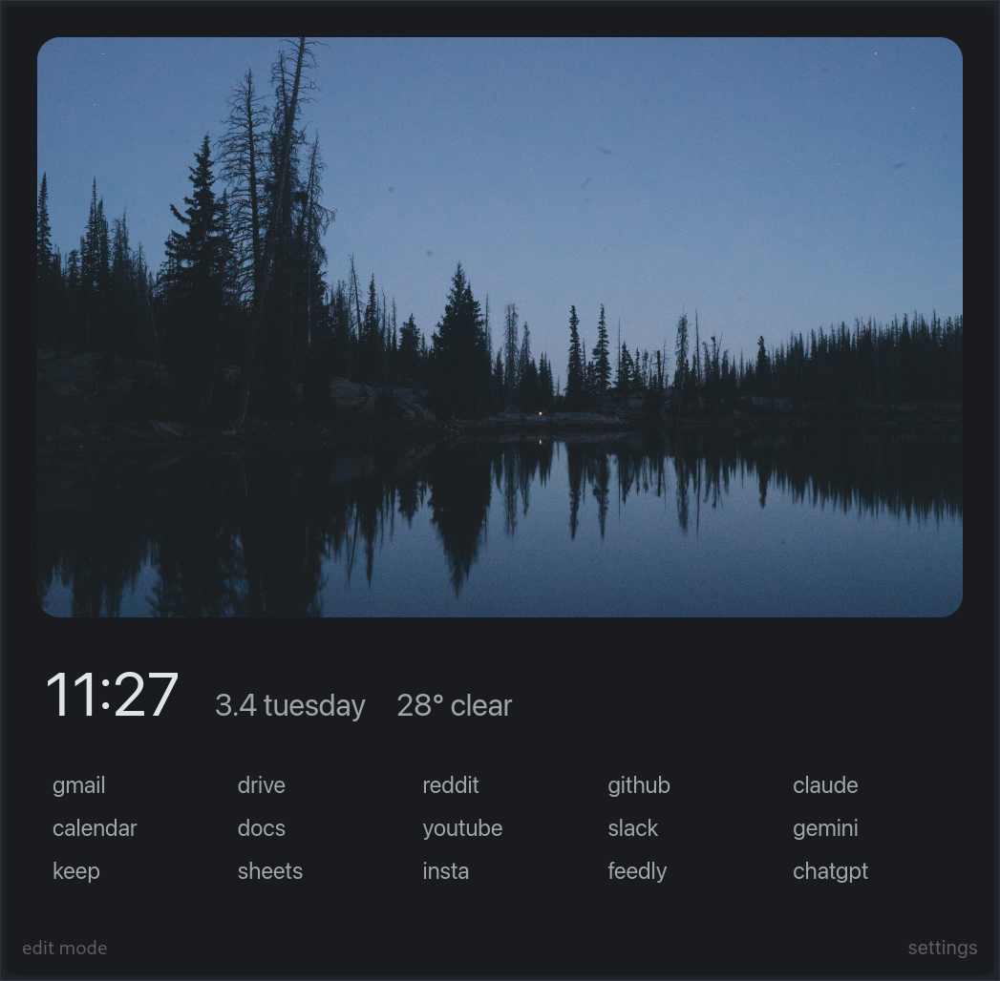
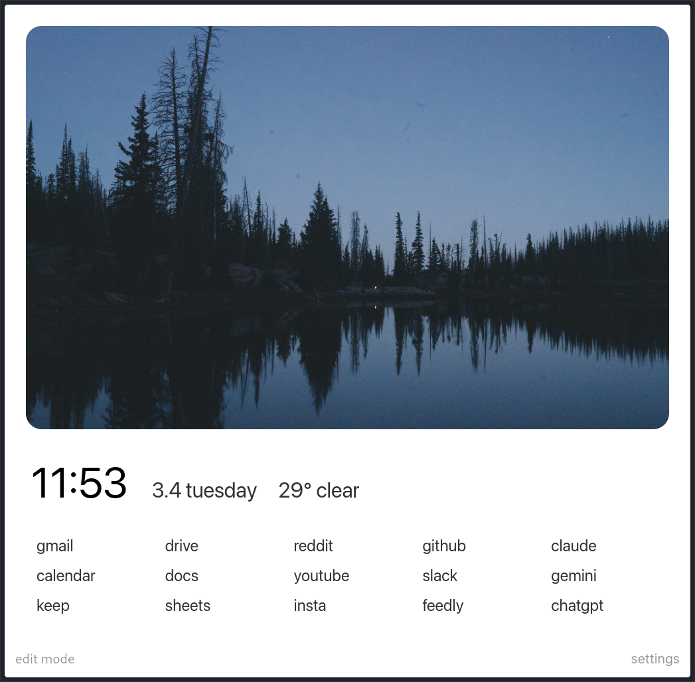

<h1 align="center">
     
    
    
     
    
    NewTab Extension
     
</h1>

<h4 align="center">A simple, yet customizable new tab page for Chrome and Firefox</h4>

## ✨ Features

✅ Current Time & Date  
✅ Live Weather (based on coordinates you set)  
✅ Editable Bookmarks Grid  
✅ Light/Dark Mode  
✅ Custom Hero Image (URL or local file)  
✅ Flexible Settings Panel  

---

## 🛠️ Installation

### 🌐 Chrome

1. Open `chrome://extensions`.
2. Enable **Developer Mode** (top-right corner).
3. Click **"Load unpacked"**.
4. Select this repository folder (where `manifest.json` is located).

Or

1. Go to the [extension page](https://chromewebstore.google.com/detail/nighhjpfiampencdhknmonmgcmfegghj?utm_source=item-share-cb).
2. And add the extension to your chrome!

---

### 🦊 Firefox

1. Open `about:debugging#/runtime/this-firefox`.
2. Click **"Load Temporary Add-on"**.
3. Select the `manifest.json` file from this repository.

Or

1. Go to the [extension page](https://addons.mozilla.org/pt-BR/firefox/addon/new-tab-by-gabrielzschmitz).
2. And add the extension to your firefox!

---

## 💡 How to Use

### 🔖 Customizing Bookmarks
- Enable **Edit Mode** (bottom-right button).
- Add, edit, or remove bookmarks directly.

### 🎭 Changing Appearance
- Open **Settings** (bottom-left link).
- Customize dark mode, hero image, and other preferences.

---

## 🔗 Compatibility

| Browser | Status       |
|---------|--------------|
| Chrome  | ✅ Supported |
| Firefox | ✅ Supported |

---

## 🤝 Contributing

Pull requests are welcome! Feel free to suggest ideas or open issues.

---

## 📑 License

This project is licensed under the MIT License. See the [LICENSE](./LICENSE)
file for more details.
